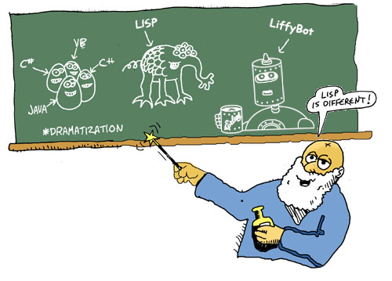

# 주문외우기

- [원문](https://www.lisperati.com/casting.html)

 Lisp를 만져본 사람이라면, 이 언어는 다른 프로그래밍 언어들과 매우 다르다고 말할 것입니다.
 실로 놀라운 방식으로 많이 다릅니다.
 이 만화책을 통해 Lisp의 독특한 디자인이 어떻게 이 언어를 강력하게 만드는지 배울 수 있습니다




`clj` 명령어를 통해 클로저의 REPL을 실행합니다.

``` clojure
$ clj
Clojure 1.11.1
user=>
```

REPL은 `R`ead `E`val `P`rint `L`oop의 약자입니다. REPL은 사용자가 입력한 코드를 읽고, 실행하고, 결과를 출력하고, 다시 반복합니다.

``` clojure
user=> (+ 1 2)
3
user=>
```

`user=>`에서 `user`는 현재 네임스페이스의 이름입니다. 네임스페이스안에서 정의한 함수/변수들은 네임스페이스에 저장됩니다. `ns`는 `n`ame`s`pace의 약자이며, 네임스페이스를 바꿀 수 있는 매크로 입니다.

 다음과 같이 `(ns spel)`로 네임스페이스를 `spel`로 바꿀 수 있습니다.

``` clojure
user=> (ns spel)
nil
spel=>
```

REPL을 종료하려면

- Window에서는 Ctrl-z를
- macOs/Linux에서는 Ctrl-d를 누르면 됩니다.


## 짚고넘어갈것

- clj 명령어
- REPL 종료법