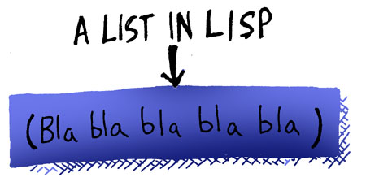

# 신택스 그리고 시맨틱

- [원문](https://www.lisperati.com/syntax.html)

모든 컴퓨터 언어는 신택스(Syntax, 문법/구조론)와 시맨틱으(Semantic, 의미론)로 이루어진 코드를 가지고 있습니다.

 프로그래밍 언어의 신택스는 기본 골격입니다. 컴파일러가 프로그램에서 무엇이 무엇인지 알 수 있도록 프로그램이 따라야만 합니다. 이로써 무엇이 함수인지, 변수인지 등을 알 수 있습니다. 프로그램의 시맨틱은 좀 더 "랜덤"한 내용을 다룹니다. 무엇이 사용가능한 명령어인지, 프로그램의 특정 지점에서 어떤 변수가 허용되는지와 같은 것들이 있습니다.

| syntax & semantics |                          |
| ------------------ | ------------------------ |
| Syntax             | 어떻게 구성되어야 하는가 |
| Semantics          | 어떻게 동작하는가        |

 리스프(Lisp, 리슾)의 첫 번째로 특별한 부분은 주요 프로그래밍 언어 중 가장 간결한 신택스를 가지고 있다는 점입니다. 기본적으로 리스프 신택스는 리스프 컴파일러에게 넘겨주는 텍스트를 리스트(list)로 넘기도록 강제합니다. 필요에 따라 중첩된 리스트 역시 가능합니다.

리스트의 시작과 끝은 괄호로 되어있습니다:

 추가적으로, 리스프 컴파일러는 코드를 읽을때 두가지 모드를 사용합니다: 코드 모드와 데이터 모드

 데이터 모드일때, 리스트에 아무거나 넣을 수 있습니다. 그러나, 컴파일러는 코드 모드에서 코드를 읽기 시작합니다.

| 모드   | 리스트                                              |
| ------ | --------------------------------------------------- |
| 코드   | 리스트를 `코드`로 읽고 실행된다                     |
| 데이터 | 리스트를 `데이터` 자체로 취급한다.(실행하지 않는다) |

 코드 모드에서는 리스트는 "폼(form)"이라 불리는 특별한 형태의 리스트여야만 합니다.

폼은 리스트이며, 이 리스트의 첫번째 심볼이 컴파일러가 이해할 수 있는 특별한 단어여야 합니다 - 보통은 함수의 이름이며, 컴파일러는 리스트의 나머지 부분을 함수의 인자로 넘김니다. 그리고 이러한 인자들을 읽을때, 데이타 모드로 변환하라고 지정하지 않는한, 코드 모드라 가정하고 읽습니다.

## 짚고넘어갈것

- 코드모드와 데이터모드
- 리스트
- 폼
