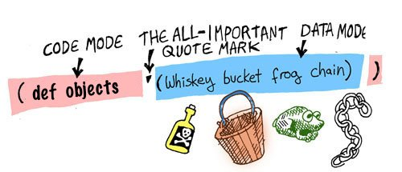

# 게임 세상을 위한 데이타 정의하기

- [원문](https://www.lisperati.com/data.html)

폼에 대해 더 이해하기 위해, 폼으로 우리가 만들 게임 세상을 데이타화 시켜봅시다.

우선, 게임에는 플레이어가 집고 사용가능한 오브젝트(Object)들이 있습니다 - 이러한 오브젝트들을 정의해 봅시다:


``` clojure
(def 상수_리스트_모든오브젝트 '(:위스키병 :양동이 :개구리 :사슬))
```

 자, 이제 이 줄을 분석하고 그 의미를 살펴봅시다: 리스프 컴파일러는 항상 `코드 모드`에서 읽기 시작하고 형식을 기대하기 때문에 첫 번째 기호인`def`를 명령어 라고 간주합니다.
 `def`는 define 즉 정의하다의 약자입니다.
 이 명령어는 주어진 값으로 변수를 설정합니다: 변수 이름은 `상수_리스트_모든오브젝트`이며, 키워드로된 오브젝트들이 리스트안에 들어있습니다.
 편의상 변하지 않는 변수 이름 앞에 `상수_`를 붙였습니다.
 이 리스트는 데이타이므로, `:위스키병`가 명령어로써 실행되지 않게 하기 위해 컴파일러를 데이타 모드로 변환시킬 필요가 있습니다.
 리스트 앞의 붙은 따옴표(`'`)는 컴파일러를 변형시키기 위한 명령어입니다.

 오브젝트 이름 앞에 콜론(`:`)이 붙어 있는데, 클로저(Clojure)언어에서는 이를 키워드(keyword)라 합니다. 키워드는 심볼(symbol)에 비해 비교하는 연산에서 빠릅니다.



이제 게임 세상에 쓰일 오브젝트들을 정의해 봤습니다. 이제 더 나아가서 게임 세상의 지도를 정의해 보겠습니다. 여기에 게임 세상이 어떻게 생겼는지 나와있는 그림이 있습니다:


이 단순한 게임에는 3개의 다른 장소가 있습니다: `거실`과 `다락방`을 가진 집이 있으며 그리고 `정원`도 있습니다.

이제 게임 세상을 표현하는 `상수_전체지도`라는 새로운 변수를 정의해 봅시다:

``` clojure
(def 상수_전체지도
  {:거실
   {:설명
    "[마법사의 집 - `거실`]: `마법사`가 소파에 코를 골며 자고있다."
    :사전_경로 {:서쪽 [:문 :정원]
                :위층 [:계단 :다락방]}}

   :다락방
   {:설명
    "[마법사의 집 - `다락방`]: 구석에 `용접`을 할 수 있는 화로가 있다"
    :사전_경로 {:아래층 [:계단 :거실]}}}

   :정원
   {:설명
    "[아름다운 `정원`]: `우물`이 앞에 보인다"
    :사전_경로 {:동쪽 [:문 :거실]}})
```

이 지도는 우리가 알고 싶은 세 곳에 대한 모든 중요한 내용을 담고 있습니다:
- 장소를 나타내는 고유한 이름 (예: 거실, 다락방, 정원)
- 그리고 그곳에서 볼 수 있는 것에 대한 간단한 설명
- 해당 장소로의 입출입 경로의 위치와 방법.

이 변수는 더도 덜도 아닌 딱 우리가 알아야 되는 정보만을 담고 있습니다. 리스퍼는 군더더기를 빼고 보기만 해도 이해하기 쉬운 작고 간결한 코드를 작성하는 것을 좋아합니다

앞선 리스트와 달리, 괄호모양이 조금 다른것을 알 수 있습니다. 사전(dictionary)과 벡터(vector)를 사용하여 이 정보를 표현했습니다.

- 벡터는 리스트와 비슷하지만, 중괄호 대신 대괄호(`[ ]`)로 둘러싸여 있습니다.
- 사전(dictionary)은 키와 값으로 되어있는 컬렉션(collection)입니다. 리스트와 비슷하게 중괄호(`{ }`)로 둘러싸여 있습니다.

| 컬렉션                     | 기호  | 예                 | big-O |
| -------------------------- | ----- | ------------------ | ----- |
| 리스트(list)               | `( )` | `(1 2 3)`          | O(n)  |
| 벡터(vector)               | `[ ]` | `[1 2 3]`          | O(1)  |
| 사전(dictionary, 딕션어리) | `{ }` | `{:a 1 :b 2 :c 3}` | O(1)  |


이제 지도와 오브젝트 목록이 있으니, 각각의 오브젝트가 지도상의 장소 어디에 있는지 알 수 있는 변수를 선언해 봅시다:

``` clojure
(def 상수_사전_오브젝트_랑_장소
  {:위스키병 :거실
   :양동이   :거실
   :사슬     :정원
   :개구리   :정원})
```

여기서, 사전을 만들어서 오브젝트랑 장소를 각각 연결하였습니다.
이 사전은 오브젝트를 키로, 장소를 값으로 가지고 있습니다. 그리고 이 장소는 지도의 키로도 쓰입니다.
여기 `:거실`, `:정원`, `:다락방` 이라는 장소를 나타내는 세 개의 키가 있습니다.

게임 세상과 그 안에 있는 오브젝트들을 정의했으니, 이제 게임 플레이어의 장소만 남았습니다.

``` clojure
(def 상수_플레이어_시작_장소
  :거실)
```

자, 이제 게임에 쓰일 게임 커맨드들을 만들러 갑시나!


## 짚고넘어갈것

- [def](https://clojuredocs.org/clojure.core/def)
- 키워드(`:`)
- 리스트(`( )`)
- 데이터를 간결하게 추리기
- 사전(`{ }`)
- 벡터(`[ ]`)