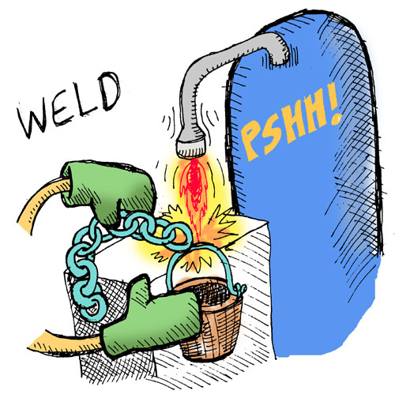
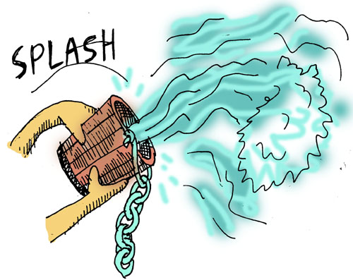

# 특별한 액션 만들기

- [원문](https://www.lisperati.com/actions.html)

이제 한단계만 더 넘으면 게임이 완성됩니다: 플레이어가 게임에서 승리하기 위해 수행해야 하는 몇 가지 특별한 행동을 게임에 추가합니다. 
 첫 번째 커맨드는 다락방에 있는 양동이에 사슬을 용접하는 것입니다:

``` clojure
(defn 용접 [오브젝트 대상]
  (if-not (and (= @atom_플레이어_현재장소 :다락방)
               (= 오브젝트 :사슬)
               (= 대상 :양동이)
               (가지고있는가? 오브젝트))
    ["그렇게 용접 할 수는 없습니다"]
    (if-not (가지고있는가? :양동이)
      ["`양동이`를 가지고 있지 않습니다."]
      (do
        (reset! atom_플레이어_사슬을_용접하였는가 true)
        ["`사슬`이 `양동이`에 단단히 용접되었습니다."]))))
```


먼저 이 작업을 이미 수행했는지 여부를 알 수 있는 새로운 전역 변수를 만들었습니다. 다음으로 용접에 적합한 조건이 모두 갖추어졌는지 확인하고 용접할 수 있는 용접 커맨드를 만들었습니다.



새로운 커맨드를 사용해 봅시다:

``` clojure
> (용접 :사슬 :양동이)

["그렇게 용접 할 수는 없습니다"]
```

이런... 우리는 양동이나 사슬이 없습니다. 그리고 주위에 용접할만 장치도 없습니다... 뭐 괜찮습니다...

이제 사슬을 건 양동이로 우물을 기르는 커맨드를 만들어 봅시다:


``` clojure
(defn 물기르기 [오브젝트 대상]
  (if-not (and (= @atom_플레이어_현재장소 :정원)
               (= 오브젝트 :양동이)
               (= 대상 :우물)
               (가지고있는가? 오브젝트))
    ["그렇게 물기르기 할 수는 없습니다"]
    (if-not @atom_플레이어_사슬을_용접하였는가
      ["물에 닿지 않습니다."]
      (do
        (reset! atom_플레이어_양동이를_채웠는가 true)
        ["`양동이`에 물을 가득 채웠습니다."]))))
```

눈치챘는지 모르겠지만 이 커맨드가 앞선 `용접` 커맨드와 매우 유사하다는 것을 알 수 있습니다... 두 커맨드 모두 오브젝트, 대상, 장소를 확인하는데 두 커맨드를 하나의 함수로 합치기에는 무리처럼 보입니다. 유감스럽습니다... ...만 리스프이기에 단순히 함수를 추가시켜 나가는게 아니라, 스펠을 외울 수 있습니다! 다음 스펠을 만들어 봅시다:

``` clojure
(def-스펠 def-액션 [커맨드명 [액션오브젝트 액션대상] 액션장소 & 액션본체]
  (let [키워드_액션오브젝트# (keyword 액션오브젝트)
        키워드_액션대상#     (keyword 액션대상)]
    `(def-스펠 ~커맨드명 [오브젝트# 대상#]
       (let [키워드_오브젝트# (keyword 오브젝트#)
             키워드_대상#     (keyword 대상#)]
         `(if-not (and (= @atom_플레이어_현재장소 ~'~액션장소)
                       (= ~키워드_오브젝트# ~'~키워드_액션오브젝트#)
                       (= ~키워드_대상# ~'~키워드_액션대상#)
                       (가지고있는가? ~'~키워드_액션오브젝트#))
            ~[(str "그렇게 " '~커맨드명 "할 수는 없습니다")]
            ~@'~액션본체)))))
```

 헛웃음이 나올 정도로 복잡한 스펠입니다. 리스트보다 따옴표, 역따옴표, 쉼표 및 기타 이상한 기호(`#`, \`, `~`, `~@`)가 더 많아 보입니다.
 뿐만 아니라 스펠이 스펠을 만들고 있습니다!
 숙련된 리스프 프로그래머라도 이런 괴물을 만들기 위해선 약간의 고민을 해야 할 것입니다.


 이 스펠에서의 요점은 이 스펠로 얼마나 정교하고 창의적인 것들을 얻을 수 있는지 보여주는 것입니다.
 또, 한 번만 작성해서 더 큰 어드벤처 게임에서 수  백 개의 커맨드를 만들 수 있다면, 못생긴 것은 그리 중요하지 않습니다.

새로운 스펠을 사용하여 못생긴 용접 커맨드를 교체해봅시다:

``` clojure
(def-액션 용접 [사슬 양동이]
  :다락방
  (if-not (가지고있는가? :양동이)
    ["`양동이`를 가지고 있지 않습니다."]
    (do
      (reset! atom_플레이어_사슬을_용접하였는가 true)
      ["`사슬`이 `양동이`에 단단히 용접되었습니다."])))
```

이 얼마나 쉽게 이해할 수 있게 됬나요. 액션 스펠을 사용하면 원하는 내용을 간결하고 정확하게 작성할 수 있습니다. 마치 게임 커맨드를 만들기 위해 자신만의 컴퓨터 언어를 만든 것과 같습니다.
 스펠과 같이 자신만의 의사 언어를 만드는 것을 **도메인 특정 언어 프로그래밍(DSL, Domain Specific Language)** 라고 하는데, 이는 빠르고 우아하게 프로그래밍 할 수 있는 매우 강력한 접근법입니다.

``` clojure
> (용접 사슬 양동이)

["그렇게 용접 할 수는 없습니다"]
```

...여전히 용접을 할 수 있는 상태는 아니지만, 커맨드는 잘 동작하고 있습니다!


다음으로, 물기르기 커맨드도 다시 작성해 봅시다:

``` clojure
(def-액션 물기르기 [양동이 우물]
  :정원
  (if-not @atom_플레이어_사슬을_용접하였는가
    ["물에 닿지 않습니다."]
    (do
      (reset! atom_플레이어_양동이를_채웠는가 true)
      ["`양동이`에 물을 가득 채웠습니다."])))  
```




그리고 마지막으로 마법사에게 물을 끼얹는 코드입니다:

``` clojure
(def-액션 끼얹기 [양동이 마법사]
  :거실
  (cond
    (not @atom_플레이어_양동이를_채웠는가)
    ["`양동이`가 비어있습니다"]

    (가지고있는가? :개구리)
    ["`마법사`는 당신이 `개구리`를 훔친 것을 알아챘습니다."
     "그는 매우 화가나서, `당신`을 지옥으로 보내버렸습니다."
     "실패! 게임 끝."]

    :else
    ["`마법사`는 잠에서 깨고, `당신`을 따뜻히 맞아주었습니다."
     "그는 (저탄수)도넛을 `당신`에게 건냈습니다."
     "성공! 게임 끝."]))
```

- `cond`는 if와 비슷하지만 여러가지 조건과 행동을 가질 수 있습니다.
  - ex) `(cond (= 1 2) "1과 2는 같습니다." (= 1 1) "1과 1은 같습니다." :else "모든 조건이 거짓입니다.")` -> `"1과 1은 같습니다."`


**마침내 텍스트 어드벤처 게임이 완성되었습니다!**

- 게임에 대한 전체 공략을 보려면 [여기](./09_cheat.md)를 클릭합니다.
- 소스 코드의 사본을 보려면 [여기](../code/src/spel.clj)를 클릭합니다.

이 튜토리얼을 최대한 간단하게 만들기 위해 리스프의 동작 방식에 대한 세부 사항들을 건너띄었으므로, 이제 그것들이 무엇인지 한번 살펴 보도록 하겠습니다...

## 짚고넘어갈것

- [and](https://clojuredocs.org/clojure.core/and)
- [str](https://clojuredocs.org/clojure.core/str)
- [cond](https://clojuredocs.org/clojure.core/cond)
- nested macro
- 도메인 특정 언어 프로그래밍(DSL, Domain Specific Language)
